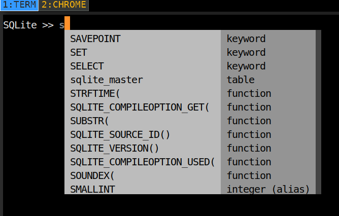
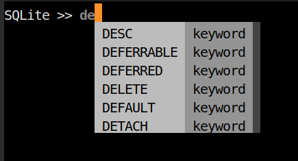

# SQLite REPL written in Python3

## Good completion





```
usage: SQLiteREPL [-h] [-H [PATH]] [-m] [-M] [--no-history-search]
                  [--no-complete-while-typing] [--no-infobar] [--no-editor]
                  [-t STYLE] [-s [STYLE]] [-p [STRING]]
                  [database]

A dead simple REPL for SQLite

positional arguments:
  database              path to database

optional arguments:
  -h, --help            show this help message and exit
  -H [PATH], --history [PATH]
                        path to history file
  -m, --multiline       enable multiline mode (useful for creating tables)
  -M, --memory          in memory database
  --no-history-search   disable history search
  --no-complete-while-typing
                        disable completion while typing
  --no-infobar          disable info bar at the bottom of the screen
  --no-editor           disable opening in $EDITOR
  -t STYLE, --tablestyle STYLE
                        set table style to <STYLE> (hint: try "orgtbl", "pipe"
                        or "simple"
  -s [STYLE], --style [STYLE]
                        pygments style (see
                        http://pygments.org/docs/styles/#builtin-styles)
  -p [STRING], --prompt [STRING]
                        prompt string
```

## Modify REPL whilst it's running  

The following `.meta` commands are supported:

```
.cd DIRECTORY       Change the working directory to DIRECTORY
.dump               Dump the database in an SQL text format
.exit               Exit this program
.help               Show this message
.output ?FILE?      Send output to FILE or stdout
.print STRING...    Print literal STRING
.prompt MAIN        Replace the prompt
.quit               Exit this program
.read FILENAME      Execute SQL in FILENAME
.shell CMD ARGS...  Run CMD ARGS... in a system shell
.show               Show the current values for various settings
.system CMD ARGS... Run CMD ARGS... in a system shell
.tables             List names of tables
```

**NOTE**:

unless you specify the database location with database, it will be
dropped in `./db.sqlite3`.

## Customisation

- check out pygments for all the possible styles
- check out tabulate for all the table types

## Limitations

-   not context sensitive
-   doesn't complete table names
-   no table headings

## Dependencies

- [prompt-toolkit](https://github.com/jonathanslenders/python-prompt-toolkit)
- tabulate
- Python >= 3.7

**Note**:

SQLiteREPL has been updated to use `prompt_toolkit 2`.

## Related

-   <https://github.com/dbcli/mycli>
