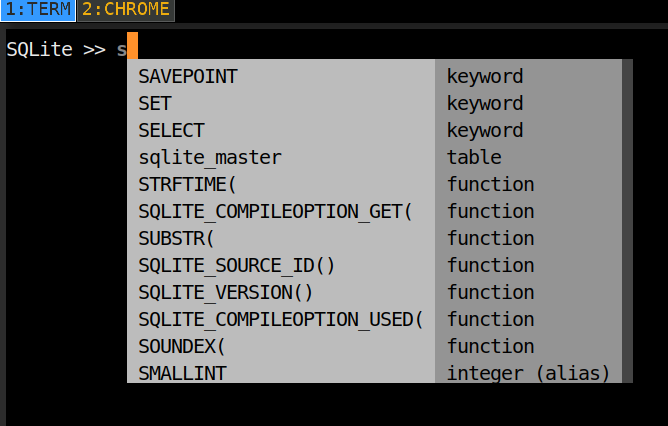
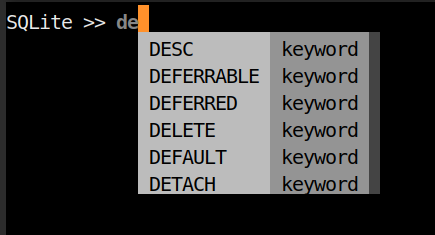

#################################
SQLite Client written in python3
#################################

Good completion
---------------

.. code:: 

  usage: SQLiteREPL [-h] [-H [PATH]] [-m] [--no-history-search]
                  [--no-complete-while-typing] [--no-infobar]
                  [--no-editor]
                  [-t STYLE] [-s [STYLE]] [-p [STRING]]
                  [database]

  A dead simple REPL for SQLite

  positional arguments:
  database path to database

  optional arguments:
  -h, --help show this help message and exit
  -H [PATH], --history [PATH]
                          path to history file
  -m, --multiline enable multiline mode (useful for creating tables)
  --no-history-search disable history search
  --no-complete-while-typing
                          disable completion while typing
  --no-infobar disable info bar at the bottom of the screen
  --no-editor disable opening in $EDITOR
  -t STYLE, --tablestyle STYLE
                          set table style to <STYLE> (hint: try
                          "orgtbl", "pipe"
                          or "simple"
  -s [STYLE], --style [STYLE]
                          pygments style (see
                          http://pygments.org/docs/styles/#builtin-styles)
  -p [STRING], --prompt [STRING]
                          prompt string

  bye!

.. note::

   unless you specify the database location with `database`, it will
   be dropped in ./db.sqlite3

Limitations
-----------
- Not context sensitive,
- doesn't complete table names
- no table headings

Dependencies
------------
- `prompt-toolkit
<https://github.com/jonathanslenders/python-prompt-toolkit>`__
- `tabulate`__
- Python >= 3.7

Related
-------

- https://github.com/dbcli/mycli

